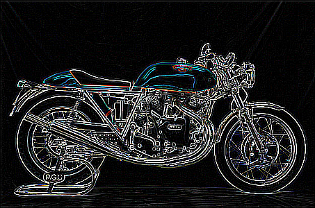

<h1>Project 1: Image Filtering and Hybrid Images</h1>
<h2>
	Name: Methew Guda 
	ID: A00381751 
	Submitted  to: Dr. Norma Linney 
	Due Date: February 09, 2016 
</h2>

<h3>
	Objective: The goal of this assignment is to write an image filtering function 
	and use it to create hybrid images using a simplified version of the IGGRAPH 2006 
	paper by Oliva, Torralba, and Schyns. 
</h3>

<h3>Sample Images:</h3>

  	

  	  	

<h3>Output Images</h3>

   	

  	  	

 

<h3>Process:</h3>

	Low Pass Filtering: I used GaussianBlur() Function from OpenCV 3.1.0 
	High Pass Filtering: I used Laplacian() Function from OpenCV 3.1.0 
	Combining two images: I used addWeighted() Function from OpenCV 3.1.0

<h3>References: </h3>

	GaussianBlur - http://docs.opencv.org/3.1.0/d4/d86/group__imgproc__filter.html#gaabe8c836e97159a9193fb0b11ac52cf1 
	Tutorial - http://docs.opencv.org/2.4/doc/tutorials/imgproc/gausian_median_blur_bilateral_filter/gausian_median_blur_bilateral_filter.html 
	Laplacian - http://docs.opencv.org/3.1.0/d4/d86/group__imgproc__filter.html#gad78703e4c8fe703d479c1860d76429e6&amp;gsc.tab=0 
	addWeighted - http://docs.opencv.org/2.4/doc/tutorials/core/adding_images/adding_images.html 

